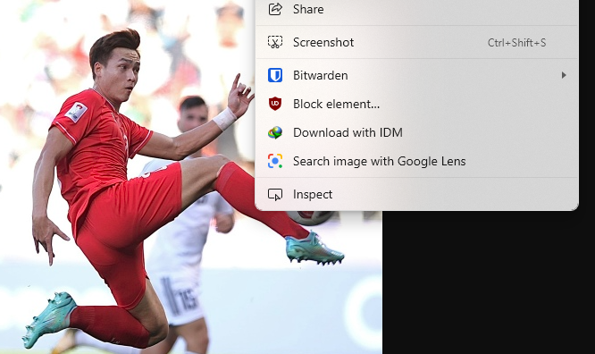
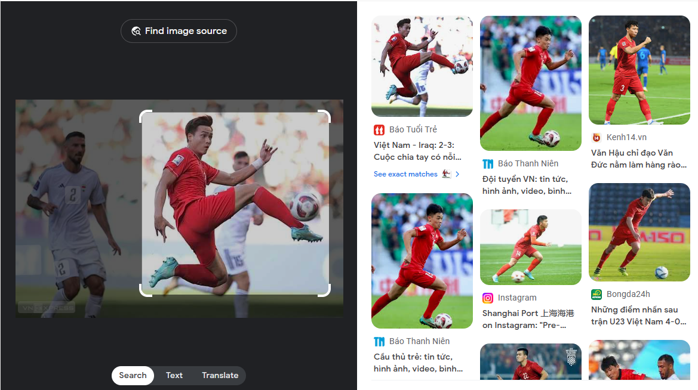

# Search image with Google Lens on Microsoft Edge
Simple extension to use Google Lens on Edge

## Install
1. Clone this repo.
2. Go to `edge://extensions/`.
3. Enable **Developer Mode**.
4. Click on **Load unpacked**.
5. Select this folder.
6. Done.

## Use
1. Right-click on an image on the web.
2. Select the **Search image with Google Lens** option.
3. View the result in a new tab.

## Preview

## Microsoft Edge Add-ons Store
Support coming soon!